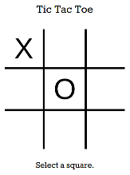

# Tic Tac Toe

A basic single player tic-tac-toe game that should be difficult (impossible) to
win, since the game intelligence is based on minimax. It also uses alpha-beta
pruning to reduce computation time and supports arbitrary grid sizes.

## Why?

I decided to write this when considering to apply to [Hacker
School](https://www.hackerschool.com/). Their [application
process](https://www.hackerschool.com/apply) asks for a link to a program you
have written completely from scratch without using frameworks. While I had a
number of programs I could have used, I had never implemented tic-tac-toe. I
used this as an excuse to get reacquainted with JavaScript, HTML and CSS. In the
end, I did not end up submitting this as my example, but it was still a fun
learning experience.

[Try it!](https://rawgit.com/batkinson/tic-tac-toe/master/tic-tac-toe.html)

